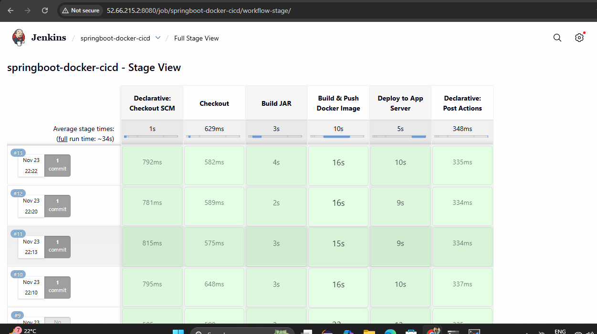

## procedure to deploy dockerised springboot application with cicd jenkins
Create 2 Ubuntu servers: 1.Jenkins Server
                         2.App Server     (Use your .pem key to connect from MobaXterm as user ubuntu.)

## Setup Jenkins Server (as ubuntu)
        sudo apt update -y
## Install Java + Maven in ubuntu user 
        sudo apt install -y openjdk-17-jdk
        sudo apt install -y maven
## Install Docker & compose plugin  in ubuntu user 
         sudo apt install -y ca-certificates curl gnupg

         sudo install -m 0755 -d /etc/apt/keyrings
         curl -fsSL https://download.docker.com/linux/ubuntu/gpg \
          | sudo gpg --dearmor -o /etc/apt/keyrings/docker.gpg

         echo \
        "deb [arch=$(dpkg --print-architecture) signed-by=/etc/apt/keyrings/docker.gpg] \
         https://download.docker.com/linux/ubuntu $(lsb_release -cs) stable" \
        | sudo tee /etc/apt/sources.list.d/docker.list > /dev/null

        sudo apt update -y
        sudo apt install -y docker-ce docker-ce-cli containerd.io docker-buildx-plugin docker-compose-plugin
## Install Jenkins
       curl -fsSL https://pkg.jenkins.io/debian-stable/jenkins.io-2023.key \
       | sudo tee /usr/share/keyrings/jenkins-keyring.asc > /dev/null

       echo deb [signed-by=/usr/share/keyrings/jenkins-keyring.asc] \
       https://pkg.jenkins.io/debian-stable binary/ \
       | sudo tee /etc/apt/sources.list.d/jenkins.list > /dev/null

       sudo apt update -y
       sudo apt install -y jenkins
## Start & enable:
     sudo systemctl enable jenkins
     sudo systemctl start jenkins
## Allow Jenkins user to use Docker
     sudo usermod -aG docker jenkins
     sudo systemctl restart jenkins
##  Get Jenkins unlock password (this will generate password for jenkins)
 #  copy public ip of jenkins and paste in chormoe with :8080
##  Install “Docker Pipeline” plugin
#  Manage Jenkins → Manage Plugins → Available → search Docker Pipeline → Install → restart Jenkins.

##  Setup App Server (as ubuntu)
       sudo apt update -y
##  Install Docker & compose plugin
       sudo apt install -y ca-certificates curl gnupg

       sudo install -m 0755 -d /etc/apt/keyrings
       curl -fsSL https://download.docker.com/linux/ubuntu/gpg \
       | sudo gpg --dearmor -o /etc/apt/keyrings/docker.gpg

      echo \
      "deb [arch=$(dpkg --print-architecture) signed-by=/etc/apt/keyrings/docker.gpg] \
       https://download.docker.com/linux/ubuntu $(lsb_release -cs) stable" \
      | sudo tee /etc/apt/sources.list.d/docker.list > /dev/null

      sudo apt update -y
      sudo apt install -y docker-ce docker-ce-cli containerd.io docker-buildx-plugin docker-compose-plugin
## Allow ubuntu to use docker:
      sudo usermod -aG docker ubuntu
      newgrp docker
## Create app directory and docker-compose file
      sudo mkdir -p /opt/myapp
      sudo chown ubuntu:ubuntu /opt/myapp
      cd /opt/myapp
      nano docker-compose.yml
## docker-compose.yml file
       services:
         spring-app:
          image: DOCKERHUB_USERNAME/my-spring-app:latest
          container_name: spring-app
          restart: always
          ports:
            - "8080:8080"
## dockerfile script
      # Dockerfile
      FROM eclipse-temurin:17-jdk-alpine

      ARG JAR_FILE=target/*.jar

      COPY ${JAR_FILE} app.jar

      EXPOSE 8080

      ENTRYPOINT ["java","-jar","/app.jar"]
## Add Jenkinsfile
        # jenkins file is in repo
## Create SSH key for deployment (Jenkins → App server)
# Generate SSH key on Jenkins server
       ssh-keygen -t rsa -b 4096 -C "jenkins-deploy"
       # press Enter for default path (~/.ssh/id_rsa) and no passphrase
## Show public key:
       cat ~/.ssh/id_rsa.pub
## Add key to App server as ubuntu user
       mkdir -p ~/.ssh
       nano ~/.ssh/authorized_keys
## Set permissions:
       chmod 700 ~/.ssh
      chmod 600 ~/.ssh/authorized_keys
## Test SSH from Jenkins server in ubuntu user
       ssh ubuntu@13.203.94.209 "hostname"
## Jenkins Credentials configuration
# Docker Hub credentials
       Path: Manage Jenkins → Credentials → System → Global → Add Credentials

       Kind: Username with password

       ID: dockerhub-creds

       Username: dcokerhub_username

       Password: dockerhub_password (or Docker Hub access token)

       Description: “Docker Hub for CI/CD”

 # SSH key to App server
       From Jenkins UI, add new credentials:

       Kind: SSH Username with private key

       ID: app-server-ssh-key

       Username: ubuntu

       Private Key: paste the content of /home/ubuntu/.ssh/id_rsa from Jenkins server.

       (You can see it with cat ~/.ssh/id_rsa on Jenkins server.)
## Create Jenkins pipeline job
        In Jenkins UI:

        New Item → Pipeline

        Name: springboot-docker-cicd

        Type: Pipeline

        Under Pipeline section:

        Definition: Pipeline script from SCM

        SCM: Git

       Repository URL: your GitHub repo (e.g. https://github.com/yourname/your-spring-app.git)

       Branch: */main (or */master as per your repo)

       Save.
  ## Run the pipeline     

  ## Here is a look at the jenkins full stage build view dashboard:

## Here is a look at the application dashboard with port number:

